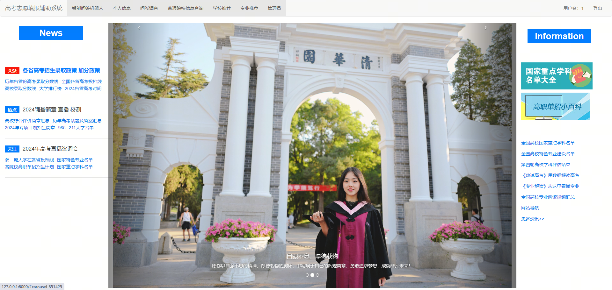
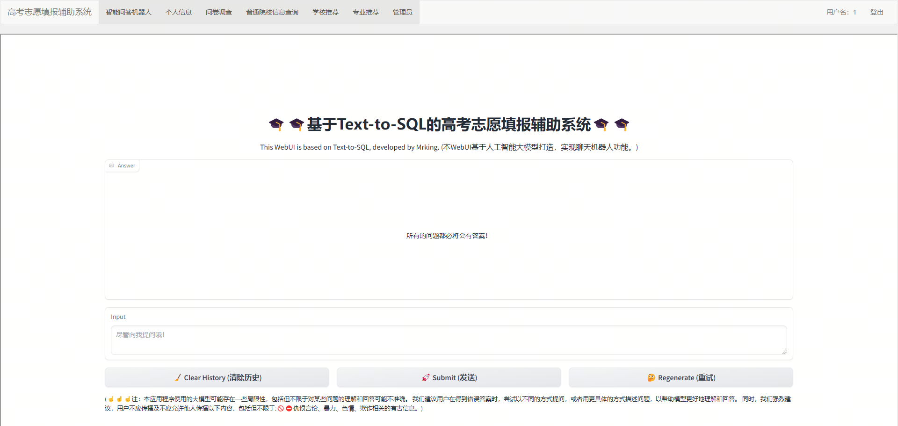
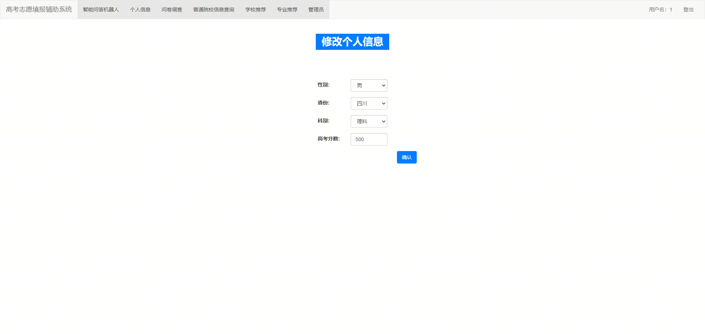
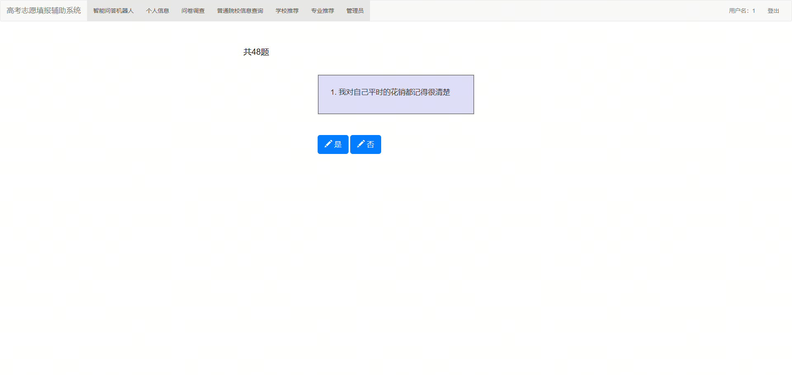
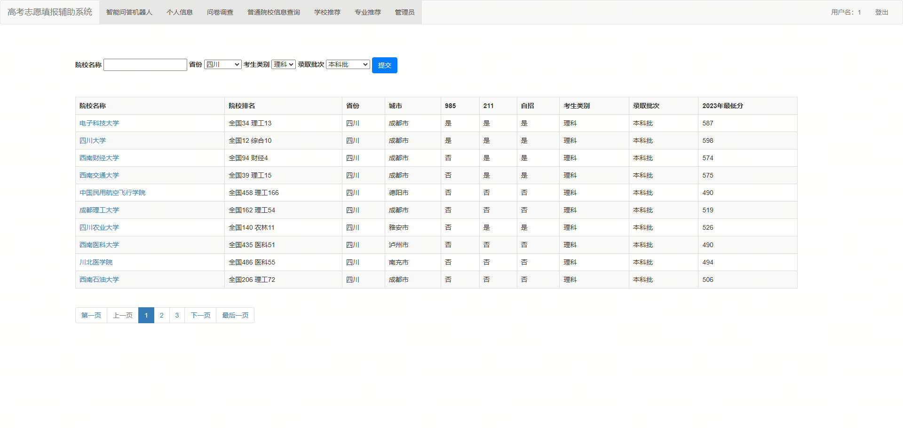
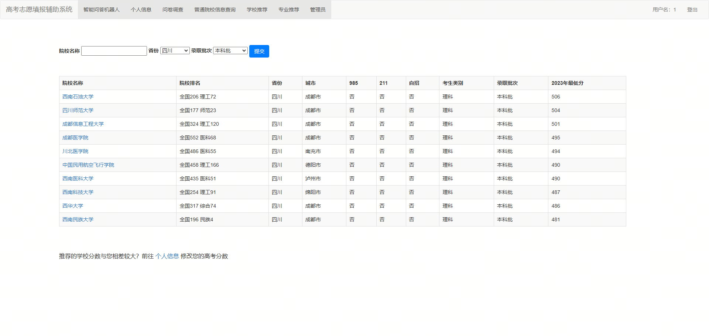
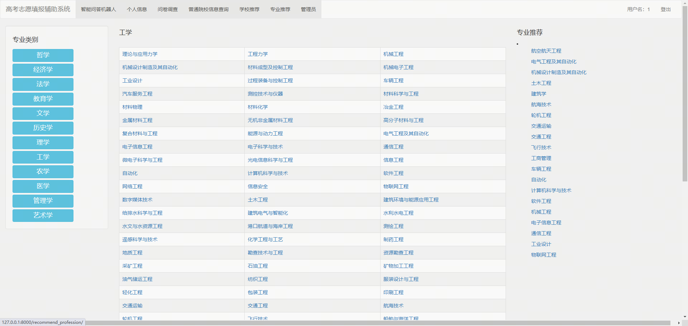
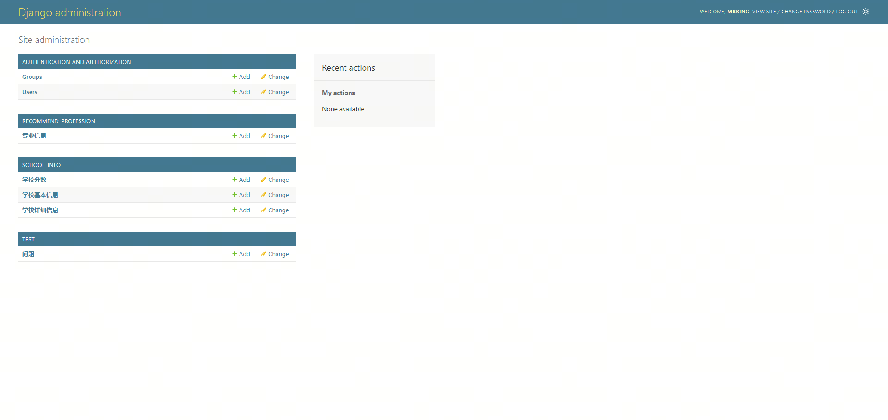

# 高考志愿填报辅助系统
本项目旨在设计并实现一个高考志愿填报辅助平台，通过集成智能问答机器人，帮助考生和家长高效、准确地完成高考志愿填报。是毕设学习项目。仅供学习、交流。

## 系统功能
### 高考志愿填报辅助系统
- 结合考生的性格测试结果、高考成绩、个人偏好及市场趋势，提供个性化的学校和专业推荐。

### 智能问答机器人
- 利用Text-to-SQL技术，将自然语言查询转换为SQL查询语句。
- 通过微调大型语言模型，准确理解用户查询意图，生成相应的SQL语句。
- 执行SQL语句从本地数据库中检索信息并利用大模型自身总结结果返回给用户。
- 如果本地没有相关信息则利用自身大模型进行推理。
- 本地数据库主要来源于爬虫，理论上数据库信息越全，问答机器人的效果越好。

#### 系统首页展示轮播图、新闻、政策等信息

#### 智能问答机器页面基于Gradio，微调Qwen1.5B-7B-Chat实现

#### 个人信息页面支持修改个人数据

#### 文件调查页面48题性格测试题

#### 院校信息查询页面

#### 院校推荐页面根据个人信息中的高考分数推荐10所学校

#### 专业推荐页面根据性格测试推荐专业

#### 管理员页面

## 技术栈
- **自然语言处理 (NLP)**
- **深度学习**
- **Text-to-SQL**
- **Django框架**
- **Prompt工程**
- **协同过滤推荐算法**

## 模型训练与优化
使用大规模自然语言查询（NLQ）到SQL的训练数据集，对Qwen1.5-7B-Chat模型进行微调，提高其在Text-to-SQL任务中的性能。

## 安装与运行
1. 克隆本项目到本地。
2. 在项目根目录下运行`pip install -r requirements.txt`安装依赖。
3. 运行run_app.py启动系统。

**注意**: 本项目需要GPU支持，GPU显存至少需要24GB以上才能运行Qwen1.5B-7B-Chat模型。

## 致谢
感谢[visionsss](https://github.com/visionsss/recommend_system_version2)提供django框架的基础代码。

**注意**: 本项目完全为学习行为，不得用于商业用途。只用与学习和交流，如有侵权，请联系删除。
